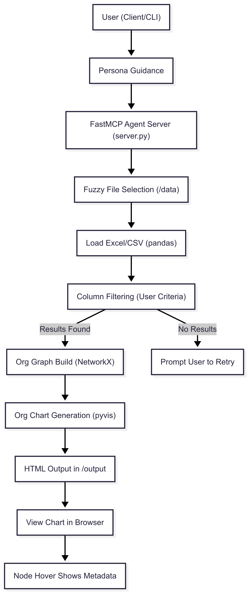

# MCP Proof of Concept

## Prerequisites
- UV
- Docker

### Installing UV

UV is a package/project manager for python. It's great.

```
# RBAC-matcher: Org Chart AI via MCP

## Overview

This project enables AI-powered exploration and visualization of org structures
from Excel files using a modular MCP (Multi-Channel Protocol) server and a
command-line client. It includes fuzzy Excel file search, org chart generation,
and OpenAI LLM-driven interactions.

---

## Quick Start for Developers

### 1. Prerequisites

- [**Python**](https://www.python.org/downloads/) (3.9+)
- [**UV**](https://github.com/astral-sh/uv) (Fast Python package/project manager)
- [**Docker Desktop**](https://docs.docker.com/desktop/) (for containerized file access and persistence)
- A valid OpenAI or Azure OpenAI API key

### 2. Setup

1. **Clone the repository:**
   ```bash
   git clone <this-repo-url>
   cd RBAC-matcher
   ```

2. **Install UV:**
   ```powershell
powershell -ExecutionPolicy ByPass -c "irm https://astral.sh/uv/install.ps1 | iex"
   ```
   Or see [uv install docs](https://github.com/astral-sh/uv#installation).

3. **Install Docker Desktop:**
   - [Get Docker](https://docs.docker.com/desktop/setup/install/).

4. **Configure Environment:**
   - Copy `.env.example` to `.env` and fill out all fields:
      - Both API keys should be the same if using only OpenAI.
      - Set endpoint URLs and versions as appropriate for your OpenAI deployment.

5. **(Optional) Set Your `sec_edgar_user_agent`:**
   - If required by your dependencies or environments, edit it accordingly (see source code).

---

### 3. Installation

```bash
uv sync
```

**Docker Build and Run:**

```bash
docker build -t rbac_matcher .
docker container create --name rbac_matcher_container -p 3000:3000 rbac_matcher
docker container start rbac_matcher_container
```

*(You may mount your `/data` volume as needed for Excel files.)*

---

### 4. Running the Server

Starts on port `3000` by default:

```bash
uv run server.py
# Or use Docker as above
```

---

### 5. Running the Client

```bash
uv run client.py
```

- Enter server port number (3000 by default).
- At the `>` prompt, enter your natural language command (e.g., "Show the org chart for Workday_Data.xlsx"). Type `exit` to quit.

---

## Features

- **Fuzzy Excel File Search**: You don’t need to remember or type the exact filename; a close match to any allowed Excel file in `/data`, `/app`, or current directory works.
- **Automated Org Chart Visualization**: Interactive HTML org charts saved alongside the Excel file.
- **Natural Language AI Agent**: Driven by persona and LLM backend; seamless query interface.

---

## Directory Layout

```
RBAC-matcher/
├── server.py        # MCP server (org chart tool with fuzzy search)
├── client.py        # CLI client agent
├── .env.example     # Environment variable template
├── personas/        # Persona instructions for AI agent
├── requirements.txt # Python dependencies (if exists)
├── Dockerfile
├── /data/           # (Optional) Excel files directory
```

---

## Troubleshooting

- **Excel file not found?**
  - Make sure your file is inside `/data` (if using Docker), `/app`, or your current working directory.
  - Typos are OK! Fuzzy search will pick the closest file.
- **Dependency errors?**
  - Run `uv sync` after pulling any updates.
- **Org chart missing?**
  - Output HTML will be created (e.g., `<YOUR_FILE>_org_chart.html`) in the data directory.
- **API errors?**
  - Double check your `.env` values and network access.

---

## Developer Notes

- See top-level docstrings in `server.py` and `client.py` for code-level orientation.
- For MCP/AI/agent extension, see the `agents` directory and associated classes.

## System Design



---

## Contributing

Issues and PRs welcome! Please ensure you adhere to typical Python formatting and include test/demo files if you update features.
```

### Installing Docker

https://docs.docker.com/desktop/setup/install/windows-install/

## Setting up Server

First, change the `sec_edgar_user_agent` on line 19.

Next, change copy the `.env.example` to `.env` and fill out the fields (both API keys should be the same)

Run these commands:
1. `uv sync`
2. `docker build -t mcp_docker_test .`
3. `docker container create --name mcp_container -p 3000:3000 mcp_docker_test` 
4. `docker container start mcp_container`

If you open the Docker Desktop App, you should see the container running. 

## Running client

1. `uv run client.py`
2. Then enter the port you specified
3. When you see the `>` prompt, you should be all set to prompt!
4. To exit without issue, just type `exit`


